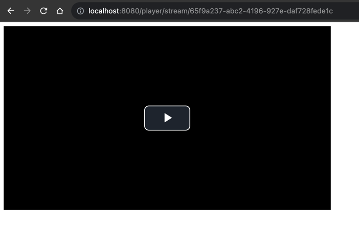

# Video Streaming

The application receives a video file from the user and uploads it to object storage. Stream video available upon
request

## Tech Stack

- Kotlin
- Ktor
- Exposed
- H2 Database
- MinIO

## API Reference

#### Upload video file

```http
  GET /video/upload
```

#### Stream video file

```http
  GET /player/stream/{uuid}
```

| Param  | Type     | Description           |
|:-------|:---------|:----------------------|
| `uuid` | `string` | **Required**. File ID |


## Screenshots

### Upload page


### Player page



### Streaming video


